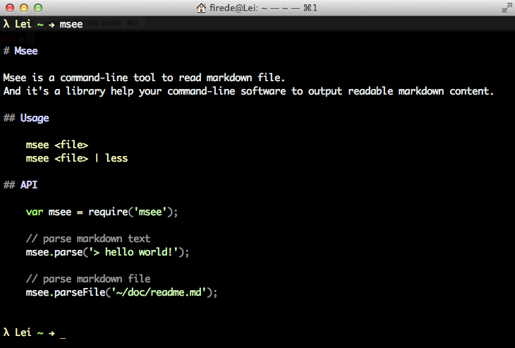

Msee
===

*Msee* is a command-line tool to read markdown file.

And it's a library help your command-line software to output readable markdown content.

## Usage

    msee <file>
    msee <file> | less

## Screenshot



## API

```javascript
var msee = require('msee');

// parse markdown text
msee.parse('> hello world!');

// parse markdown file
msee.parseFile('~/doc/readme.md');
```

## Installation
```Shell
npm install -g msee
```
